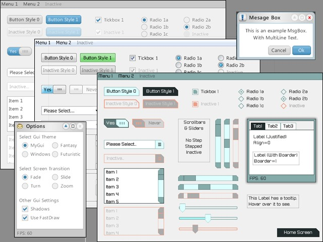

# guiBasic
##GUI for CerberusX

\

Unzip the downloaded file and copy the *guiBasic* folder into your CerberusX *modules_ext* folder

At the beginning of your code:

`Import guiBasic`

In your OnUpdate() method:

`Gui.Update()`

In Your OnRender() method:

`Gui.Draw()`
 
```
Import mojo
Import guiBasic
Function Main();New Game;End Function
Class Game Extends App
	Method OnCreate()
		SetUpdateRate(60)
	End Method
	Method OnUpdate()
		Gui.Update()
	End Method
	Method OnRender()
		Cls(200,200,200)
		Gui.Draw()
	End Method
End Class
```